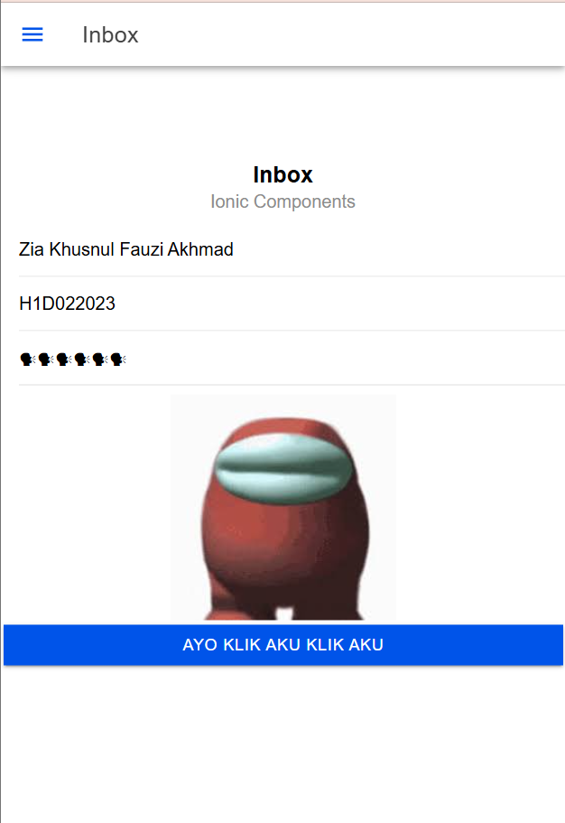

# Tugas Pertemuan 6
Nama       : Zia Khusnul Fauzi Akhmad

NIM        : H1D022023

Shift Baru : Shift D

## Cara Menggunakan Component dalam Ionic

1. **Pilih Component yang Ingin Digunakan**:
    Cari component yang ingin Anda gunakan dari dokumentasi resmi Ionic atau dari direktori `src/app` jika component tersebut sudah ada di proyek Anda.

2. **Import Component**:
    Pastikan component yang ingin Anda gunakan sudah di-import di modul yang sesuai. Buka file `app.module.ts` atau modul lain yang relevan dan tambahkan import statement jika belum ada. Contoh:
    ```typescript
    import { NamaComponent } from './path/to/component';
    ```

3. **Tambahkan Component ke Deklarasi Modul**:
    Pastikan component tersebut terdaftar di dalam array `declarations` di modul yang sesuai. Contoh:
    ```typescript
    @NgModule({
      declarations: [
        NamaComponent,
        // component lainnya
      ],
      // konfigurasi lainnya
    })
    export class AppModule { }
    ```

4. **Gunakan Component dalam Halaman**:
    Untuk menggunakan component tersebut dalam halaman Ionic, tambahkan tag HTML component tersebut di file `.html` halaman yang diinginkan. Contoh:
    ```html
    <app-nama-component></app-nama-component>
    ```

    ## Hasil Screenshot

    Berikut adalah contoh hasil screenshot dari penggunaan component dalam aplikasi Ionic:

    